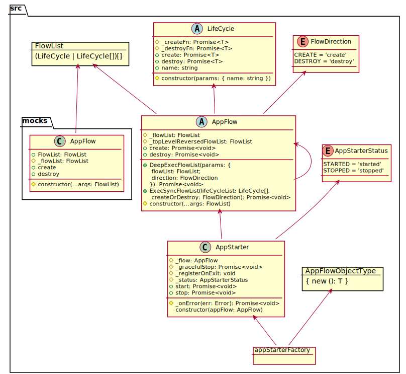

[](https://beecode.semaphoreci.com/projects/msh-node-app)
[](https://codecov.io/gh/beecode-rs/msh-node-app)
[](https://github.com/beecode-rs/msh-node-app/blob/main/LICENSE)  
[](https://nodei.co/npm/@beecode/msh-node-app)

# msh-node-app

Micro-service helper: app initializer

This project is intended to be used in typescript project to help with app initialization.

<!-- toc -->

- [Install](#install)
- [Diagram](#diagram)
- [Usage](#usage)
  * [basic-example](#basic-example)

<!-- tocstop -->

## Install

`npm i @beecode/msh-node-app`


## Diagram




## Usage

### basic-example

After FistInitiable is finished SecondInitiable and ThirdInitiable are run in parallel

```typescript
// ./initiate/first-initiable.ts
import { LifeCycle } from '@beecode/msh-node-app'

export class FirstInitiable extends LifeCycle {
  constructor() {
    super({ name: 'First initiable' })
  }

  protected async _createFn(): Promise<any> {
    console.log('%%%%%% First create') // eslint-disable-line no-console
  }

  protected async _destroyFn(): Promise<any> {
    console.log('%%%%%% First destroy') // eslint-disable-line no-console
  }
}


// app.ts
import { AppFlow } from '@beecode/msh-node-app'

export class App extends AppFlow {
  public constructor() {
    super(new FirstInitiable(), [new SecondInitiable(), new ThirdInitiable()])
  }
}


// index.ts
import { LogLevelType } from '@beecode/msh-node-log'
import { ConsoleLogger } from '@beecode/msh-node-log/lib/console-logger'

import { NodeAppLogger } from '@beecode/msh-node-app/lib/util/logger'

import { appStarterFactory } from '@beecode/msh-node-app'
import { App } from './app'

NodeAppLogger(new ConsoleLogger({ logLevel: LogLevelType.DEBUG }))

appStarterFactory(App)
  .start()
  .catch((err) => console.log(err)) // eslint-disable-line no-console
```

after running example (./test/basic-example/index.ts)

```shell
$ npx ts-node ./index.ts 
2021-11-20T01:07:53.198Z - DEBUG:  First initiable Create START
%%%%%% First create
2021-11-20T01:07:53.200Z - DEBUG:  First initiable Create END
2021-11-20T01:07:53.200Z - DEBUG:  Second initiable Create START
%%%%%% Second create
2021-11-20T01:07:53.201Z - DEBUG:  Third initiable Create START
%%%%%% Third create
2021-11-20T01:07:53.201Z - DEBUG:  Second initiable Create END
2021-11-20T01:07:53.201Z - DEBUG:  Third initiable Create END
```
